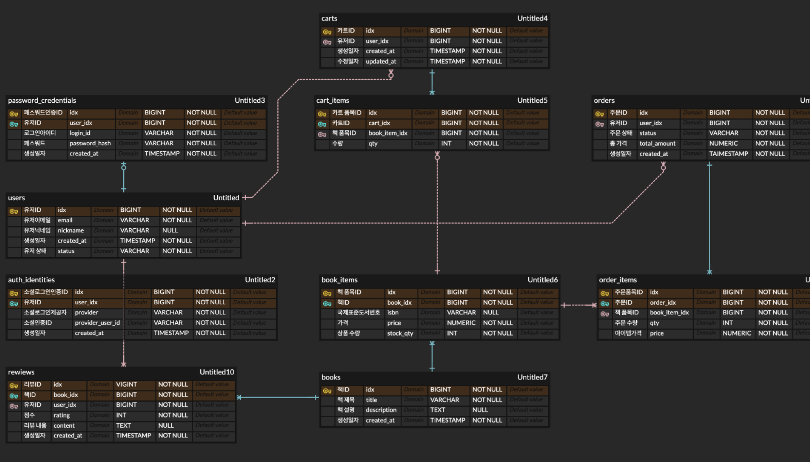

Chapter 1. 실전 SQL - 어떤 Query를 작성해야 할까?
===
목차
---
* ERD 재정비
* DDL
* 페이징
  
ERD 재정비
---

이전에 mermaid 코드로 작성하였던 erd 내용을 조금 보강하여 erd 클라우드 내용으로 다시 구성하였습니다.  
  
erd는 다음과 같이 구성되며 not null 여부와 identifing 관계 여부 등을 고려하여 erd를 보강하였습니다.

품목 자체로서 존재해야 하는 것, 그리고 그 품목의 실제 수량과 종류를 관리하는 테이블로 나누고 관리하였고 이 품목간의 관계로서 실제 서비스를 구성하도록 erd를 구성하였습니다.

DDL
---
ddl은 이전 주차 스터디 내용에서도 서술하였듯이 지금 erd를 구성한 것 처럼 데이터베이스 테이블들의 틀을 작성하고 그 관계를 설정해주는 기본 베이스를 구성하는 언어 종류입니다.  
  
테이블 내용 작성 자체는 일종의 구조체를 작성하는 문법과 거의 다름 없이 작성하며 테이블 이름과 그 안의 요소(컬럼)들의 명칭을 지정해줌으로서 구성이 되며, 이러한 구조를 베이스로 데이터베이스에 데이터의 CRUD룰 진행하게 됩니다.  
  
위의 erd 규칙에 따라 뽑아낸 DDL은 다음과 같습니다.

``` SQL
-- users 테이블: 사용자 기본 정보
CREATE TABLE users (
  id           BIGSERIAL PRIMARY KEY,                                            -- 사용자 PK (자동 증가)
  email        VARCHAR      NOT NULL,                                            -- 사용자 이메일 (로그인/고유)
  nickname     VARCHAR      NULL,                                                -- 사용자 닉네임
  created_at   TIMESTAMP    NOT NULL DEFAULT now(),                              -- 생성 시각 (기본값 현재)
  status       VARCHAR(20)  NOT NULL DEFAULT 'ACTIVE'                            -- 사용자 상태 (활성/정지/탈퇴 등)
    CHECK (status IN ('ACTIVE','PENDING','SUSPENDED','DELETED'))                 -- 상태값 제약조건
);

-- email은 고유해야 함
CREATE UNIQUE INDEX ux_users_email ON users(email);


-- password_credentials 테이블: 자체 로그인 계정 정보
CREATE TABLE password_credentials (
  id            BIGSERIAL PRIMARY KEY,                                           -- PK
  user_id       BIGINT      NOT NULL REFERENCES users(id),                       -- FK: users.id
  login_id      VARCHAR     NOT NULL,                                            -- 로그인 아이디 (별도)
  password_hash VARCHAR     NOT NULL,                                            -- 비밀번호 해시
  created_at    TIMESTAMP   NOT NULL DEFAULT now(),                              -- 생성 시각

  CONSTRAINT uq_password_credentials_user UNIQUE (user_id),                      -- 유저당 하나만 허용
  CONSTRAINT uq_password_credentials_login UNIQUE (login_id)                     -- 로그인 아이디는 고유
);

-- user_id 검색 인덱스
CREATE INDEX ix_password_credentials_user_id ON password_credentials(user_id);


-- auth_identities 테이블: 소셜 로그인 계정 정보
CREATE TABLE auth_identities (
  id               BIGSERIAL PRIMARY KEY,                                        -- PK
  user_id          BIGINT     NOT NULL REFERENCES users(id),                     -- FK: users.id
  provider         VARCHAR    NOT NULL,                                          -- 소셜 로그인 제공자 (구글/카카오 등)
  provider_user_id VARCHAR    NOT NULL,                                          -- 소셜 로그인 식별자
  created_at       TIMESTAMP  NOT NULL DEFAULT now(),                            -- 생성 시각

  CONSTRAINT uq_auth_identity UNIQUE (provider, provider_user_id)                -- 제공자+아이디 조합 고유
);

-- user_id, provider 검색 인덱스
CREATE INDEX ix_auth_identities_user_id ON auth_identities(user_id);
CREATE INDEX ix_auth_identities_provider ON auth_identities(provider);


-- books 테이블: 책(작품) 메타데이터
CREATE TABLE books (
  id          BIGSERIAL PRIMARY KEY,                                             -- PK
  title       VARCHAR    NOT NULL,                                               -- 책 제목
  description TEXT       NULL,                                                   -- 책 설명
  created_at  TIMESTAMP  NOT NULL DEFAULT now()                                  -- 생성 시각
);


-- book_items 테이블: 실제 판매 단위 (포맷/재고/가격)
CREATE TABLE book_items (
  id         BIGSERIAL PRIMARY KEY,                                              -- PK
  book_id    BIGINT     NOT NULL REFERENCES books(id),                           -- FK: books.id
  isbn       VARCHAR    NULL,                                                    -- ISBN (전자책/번들 NULL 허용)
  price      NUMERIC(12,2) NOT NULL,                                             -- 가격
  stock_qty  INT        NOT NULL DEFAULT 0,                                      -- 재고 수량
  created_at TIMESTAMP  NOT NULL DEFAULT now()                                   -- 생성 시각
);

-- ISBN 유니크 (NULL은 허용)
CREATE UNIQUE INDEX ux_book_items_isbn
  ON book_items(isbn) WHERE isbn IS NOT NULL;

-- book_id 검색 인덱스
CREATE INDEX ix_book_items_book_id ON book_items(book_id);


-- carts 테이블: 장바구니
CREATE TABLE carts (
  id         BIGSERIAL PRIMARY KEY,                                              -- PK
  user_id    BIGINT     NOT NULL REFERENCES users(id),                           -- FK: users.id
  created_at TIMESTAMP  NOT NULL DEFAULT now(),                                  -- 생성 시각
  updated_at TIMESTAMP  NOT NULL DEFAULT now()                                   -- 수정 시각
);

-- user_id 검색 인덱스
CREATE INDEX ix_carts_user_id ON carts(user_id);


-- cart_items 테이블: 장바구니 내 항목
CREATE TABLE cart_items (
  id           BIGSERIAL PRIMARY KEY,                                            -- PK
  cart_id      BIGINT   NOT NULL REFERENCES carts(id) ON DELETE CASCADE,         -- FK: carts.id, 카트 삭제 시 함께 삭제
  book_item_id BIGINT   NOT NULL REFERENCES book_items(id),                      -- FK: book_items.id
  qty          INT      NOT NULL CHECK (qty > 0),                                -- 수량 (0 이상)

  CONSTRAINT uq_cart_items_cart_item UNIQUE (cart_id, book_item_id)              -- 같은 카트에 같은 아이템 중복 불가
);

-- cart_id, book_item_id 검색 인덱스
CREATE INDEX ix_cart_items_cart_id ON cart_items(cart_id);
CREATE INDEX ix_cart_items_book_item_id ON cart_items(book_item_id);


-- orders 테이블: 주문
CREATE TABLE orders (
  id           BIGSERIAL PRIMARY KEY,                                            -- PK
  user_id      BIGINT        NOT NULL REFERENCES users(id),                      -- FK: users.id
  status       VARCHAR       NOT NULL,                                           -- 주문 상태 (예: PENDING/PAID/...)
  total_amount NUMERIC(12,2) NOT NULL,                                           -- 총액
  created_at   TIMESTAMP     NOT NULL DEFAULT now()                              -- 생성 시각
);

-- user_id, status 검색 인덱스
CREATE INDEX ix_orders_user_id ON orders(user_id);
CREATE INDEX ix_orders_status ON orders(status);


-- order_items 테이블: 주문 상세 항목 (스냅샷)
CREATE TABLE order_items (
  id           BIGSERIAL PRIMARY KEY,                                            -- PK
  order_id     BIGINT        NOT NULL REFERENCES orders(id) ON DELETE CASCADE,   -- FK: orders.id
  book_item_id BIGINT        NOT NULL REFERENCES book_items(id),                 -- FK: book_items.id
  qty          INT           NOT NULL CHECK (qty > 0),                           -- 수량
  price        NUMERIC(12,2) NOT NULL,                                           -- 당시 가격 (스냅샷)

  CONSTRAINT uq_order_items_order_item UNIQUE (order_id, book_item_id)           -- 같은 주문에 같은 아이템 중복 불가
);

-- order_id, book_item_id 검색 인덱스
CREATE INDEX ix_order_items_order_id ON order_items(order_id);
CREATE INDEX ix_order_items_book_item_id ON order_items(book_item_id);


-- reviews 테이블: 사용자 리뷰
CREATE TABLE reviews (
  id         BIGSERIAL PRIMARY KEY,                                      -- PK
  book_id    BIGINT     NOT NULL REFERENCES books(id),                   -- FK: books.id
  user_id    BIGINT     NOT NULL REFERENCES users(id),                   -- FK: users.id
  rating     INT        NOT NULL CHECK (rating BETWEEN 1 AND 5),         -- 평점 1~5
  content    TEXT       NULL,                                            -- 리뷰 내용
  created_at TIMESTAMP  NOT NULL DEFAULT now(),                          -- 생성 시각

  CONSTRAINT uq_reviews_user_book UNIQUE (user_id, book_id)              -- 같은 유저가 같은 책에 여러 리뷰 불가
);

-- book_id, user_id 검색 인덱스
CREATE INDEX ix_reviews_book_id ON reviews(book_id);
CREATE INDEX ix_reviews_user_id ON reviews(user_id);


-- carts.updated_at 자동 갱신 트리거 함수
CREATE OR REPLACE FUNCTION trg_set_timestamp()
RETURNS TRIGGER AS $$
BEGIN
  NEW.updated_at = now();
  RETURN NEW;
END;
$$ LANGUAGE plpgsql;

-- carts 테이블 업데이트 시 updated_at 자동 변경
DROP TRIGGER IF EXISTS set_timestamp_on_carts ON carts;
CREATE TRIGGER set_timestamp_on_carts
BEFORE UPDATE ON carts
FOR EACH ROW
EXECUTE FUNCTION trg_set_timestamp();

-- 트랜잭션 종료
COMMIT;
```
페이징
---
데이터베이스는 그 특성상 수많은 데이터를 저장하고 관리하게 됩니다. 그리고 그러한 상황에서 가끔 테이블의 데이터를 전부 불러와야 하는 상황이 발생할 수도 있는데, 이러한 데이터를 한번에 다 불러와서 전송하게 되면 컴퓨터 성능의 문제를 일으킬 뿐만 아니라 네트워크 전송량의 증가로 인한 응답 지연 등의 문제가 발생하게 됩니다.  
  
따라서 그 결과를 일부 구간만 선택해서 반환하는 기능이 반드시 필요하게 되는데, 이것을 DB에서 paging이라고 부르는 방식으로 일부 구간만 선택하여 반환하는 기능을 사용하게 됩니다.  
  
OFFSET, LIMIT, CURSER 등의 키워드로서 페이징을 실현 가능합니다.

### OFFSET + LIMIT 방식
``` SQL
SELECT * 
FROM books 
ORDER BY created_at DESC
LIMIT 10 OFFSET 20;
```

10개를 가져오라는 제한과 어느 열부터의 데이터를 가져올 것인지에 대해서는 이런 문법으로 작성이 가능합니다. 가장 단순하지만 오프셋이 커지면 그만큼 비용이 커진다는 단점이 존재합니다.

### Keyset / Curser 방식
``` SQL
SELECT * 
FROM books 
WHERE created_at < '2025-09-25 12:00:00'
ORDER BY created_at DESC
LIMIT 10;
```
위의 큰 OFFSET에 따른 성능 저하를 피하고 마지막 읽은 위치 등의 게시글 페이지 나누기 등의 탐색 방법을 적용할때는 다음과 같은 방식으로 적용합니다.

후기
---
erd를 보기 좋게 그리는 것이 생각보다 많은 시간을 소요하게 만들었지만 나름 재미있는 활동이었습니다.
페이징의 경우는 몰랐던 개념이기도 해서 지식이 조금 더 는 느낌이었습니다.