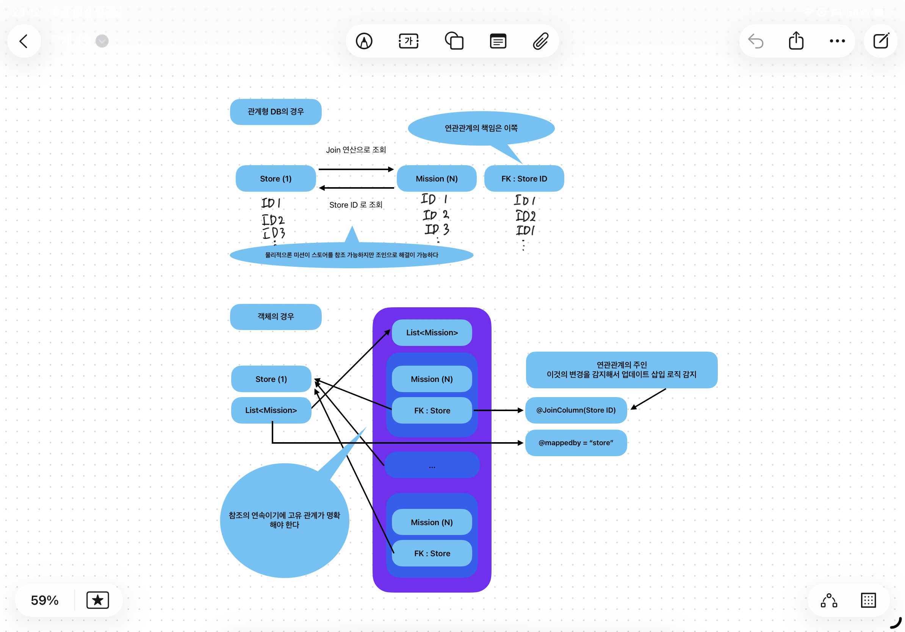

Chapter 4. JPA 시작
===
목차
---
* ORM이란
* 객체 참조방식과 관계형 DB의 패러다임 불일치
* JPA의 등장
* 계층형 구조
* 도메인 주도 개발
  * 컨트롤러
  * 서비스
  * 레파지토리
  * 엔티티
* 최종 프로젝트 세팅
  
API와 REST API
---
### ORM이란
Object Relational Mapping의 줄임말로서 자바의 객체를 관계형 데이터베이스 클래스에 자동으로 연결시켜 CRUD SQL문을 직접 짜서 날릴 필요 없이 객체로서 다룰 수 있게 해주는 기술입니다.  
  
### 객체 참조 방식과 관계형 DB의 패러다임 불일치
  
백엔드 프로그램은 메인 메모리 위에서 동작하며, 객체 간의 관계를 포인터나 참조(reference)를 통해 직접 연결합니다. 따라서 하나의 객체에서 다른 객체로 접근하는 연산은 단순한 메모리 참조로 이루어지며, 연속적인 탐색도 비용이 거의 들지 않습니다.  
  
반면, 데이터베이스는 대용량 데이터를 영구 저장하기 위해 디스크 기반의 집합적 패러다임을 따릅니다. 여기서 데이터 간의 관계는 객체 참조가 아닌 외래 키와 조인을 통해 표현됩니다. 그리고 이 행위에는 상당한 비용이 따릅니다.  
  
따라서 객체 지향의 참조 기반 탐색과 관계형 데이터베이스의 집합 기반 질의 사이에는 본질적인 사고방식의 차이가 존재합니다. 이 차이가 바로 패러다임 불일치의 근원이고 ORM은 이 패러다임 불일치를 해결하기 위해 고안된 매핑입니다.  
  
다음과 같은 예시가 대표적인 불일치 사례입니다.  

  
1. 데이터베이스에서는 A <-> B라는 관계를 정의하기만 하면 쿼리문으로 조회하여 사용이 가능합니다만, 객체 지향에서는 이를 A->B, A<-B 두개의 관계로 분리해서 따로 선언해주어야 합니다.
2. 객체는 각 컬럼을 개별적으로 가리키는 요소로서 취급하지만 db는 단순 관계형 처리를 데이터베이스 엔진에 위임하기에 동작 방식과 데이터 구조가 다릅니다. 이로 인해 업데이트를 해야 하는 상황이 발생한다면 n+1 문제가 발생하는 등의 문제점이 발생할 수 있습니다. (이는 뒤에서 좀 더 자세히 다루겠습니다.)

### JPA의 등장
JPA의 등장은 이 패러다임의 불일치를 해소시켜 주었습니다. 영속성 컨텍스트를 통해 엔티티 객체의 변동을 추적하여 데이터베이스에 실제로 반영하는 쿼리를 JPA가 스스로 짜주기 때문에 영속성 컨텍스트가 1차 캐시 역할을 하여 패러다임 불일치의 문제를 해결해주고 데이터베이스 CRUD 로직 생성의 생산성을 높여 주었습니다.  
  
### 계층형 구조의 등장
사실 백엔드 서버에서 해 줘야 하는 일을 굳이 단순화시키자면 데이터베이스의 변경과 프론트에서 요구하는 사용자 정보와 연결시켜 상태를 유지시키는 api를 제공하는데 그 의의가 있습니다.  
  
그 말은 엔드포인트 정보가 왔을때 그 엔드포인트에 맞는 메소드를 호출시키고 그 메소드를 통해 데이터베이스에 쿼리를 날리고, 정보를 받아오고. 그 정보를 다시 가공해서, 객체로 날려보내는 행위를 하면 되고 이론상으로는 하나의 객체가 그 일을 하도록 설계할 수 있습니다.  
  
다만 이는 객체 지향 원칙 중에 하나인 단일 책임 원칙을 위배하게 되고 개발의 복잡도를 증가시킵니다.
그래서 등장하게 된 개념이 바로 계층형 구조이고 그 계층형 구조의 구성은 다음과 같습니다.
  
#### 컨트롤러
컨트롤러를 한마디로 요약하면 http 입출력 담당의 책임이 있습니다.  
컨트롤러는 적절한 엔드포인트를 받아들여 요청에 맞는 dto를 받아들이고 내보내며 입출력의 책임만을 가지고 있으며 다른 책임은 service 객체에게 넘겨 서비스와 정보를 주고받고 전달하는 책임만을 가진 객체입니다.
  
#### 서비스
서비스를 한마디로 요약하면 로직과 데이터 변환 담당으로서,  
핵심 비즈니스 로직과 데이터의 가공 및 변환 책임을 가진 주체입니다. 필요에 따라 엔티티와 dto 간의 데이터 가공 및 생성을 담당하여 백엔드의 메인 로직을 담당하게 됩니다.  

#### 레파지토리
레파지토리를 한마디로 요약하면 영속화 담당입니다.  
아까도 설명하였듯이 자바의 객체 참조 패러다임과 데이터베이스간의 불일치를 해결해주는 영속성 컨텍스트를 관리하는 주체로서, 간단하게 생각하면 쿼리 변환과 객체 엔티티간의 연결과 관리를 책임지는 담당이라고 생각하면 편합니다.  
  
#### 엔티티
자바에서 어떤 주제를 가진 무언가로서 백엔드 로직에서 레파지토리에 의해 영속화되어 관리되는 피 대상자입니다. 서비스에서 이 엔티티를 가지고 dto로 가공하는 등의 로직을 진행하며, 저어어엉말 간단하게 생각하면 ddl 틀을 갖춘 자바에서 객체로서 다루는 데이터베이스 테이블 항목이라고 생각하면 되지만, 자기 자신의 데이터의 정합성을 판단하는 등의 책임은 엔티티에서 가지고 있습니다. 이는 엔티티 자체에서 스스로 로직을 가질 수도 있지만 단일 책임 원칙을 아주 훌륭하게 준수하여 각 항목을 vo로 빼버리고 그 vo에서 검증 책임을 가지게 하면 훌륭한 설계가 됩니다.  
  
### 도메인 주도 개발
우리가 계층별로 나누는 행위까지는 진행하였지만 여전히 그 구조는 복잡했습니다. 그도 그럴 것이 하나의 계층 파일 안에 다양한 계층 객체들이 존재하고 이것들이 얼기 설기 얽혀 있어 계층을 파악하는 행위가 생각보다 매우 힘들기 때문입니다. 그래서 해당하는 도메인 주제별로 파일과 로직들을 나누고 관리하는 도메인 주도 개발이라는 것이 등장하게 되었고 그 도메인(주로 엔티티)에 관련된 컨트롤러 서비스 레파지토리를 올리고 관리하면서 각 도메인별로 관리하고 유지보수하며 분리하고 관리하는 편의를 증가시킬 수 있었습니다.
  
### 최종 프로젝트 세팅
4주차 미션 진행으로 구성해보았습니다.  
[4주차 미션](https://github.com/hexter31376/umc_mission4)
  
1주차의 erd를 바탕으로 엔티티 구성을 완료하였고, 그 엔티티는 erd와 ddl을 바탕으로 구성하였고 몇몇 수정사항과 비즈니스 로직을 반영하여 연관관계 매핑을 진행하였습니다.  
1. 장바구니 엔티티를 여러개 가지는 논리적 오류 해결 - 장바구니는 멤버당 하나씩만
2. 멤버의 생명주기와 북의 생명주기를 따라가도록 부가적인 엔티티들의 연관관계 설정
  
### 후기
기존에 알고 있던 개념과 더불어서 왜 패러다임 불일치가 발생하는지에 대해 대략적으로 이해 할 수 있어 뜻깊은 학습 주차였습니다.
다음 주차 스터디 활동을 통해 더욱 깊은 이해를 하고 싶습니다.  